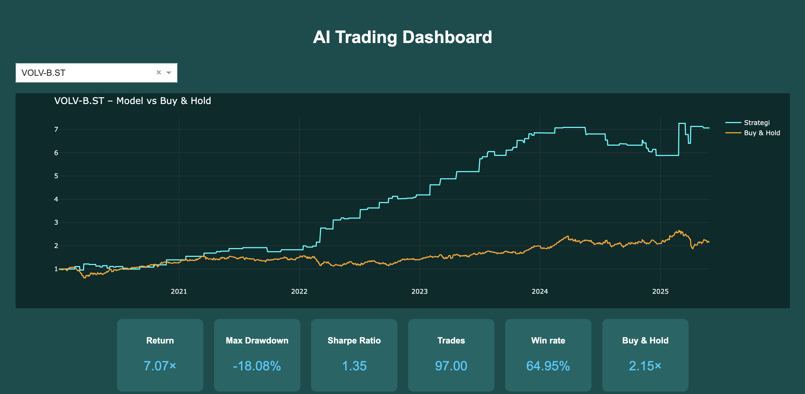
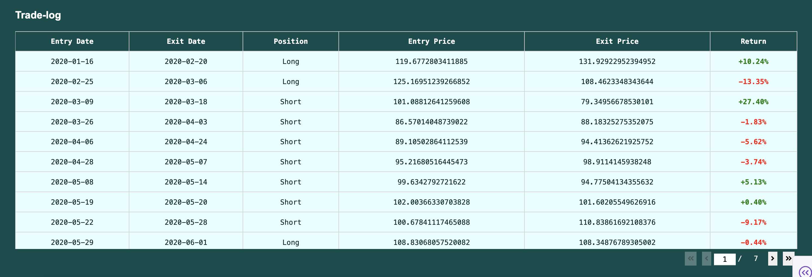

# AI-Powered Trading Strategy Dashboard

This project implements a machine learning pipeline for training, evaluating, and visualizing AI-based trading strategies using historical stock data. The model predicts trading signals (long, short, or neutral), simulates realistic trading behavior, and visualizes both performance and risk metrics through an interactive Dash dashboard.

---

## Project Overview

- **Goal:** Develop and test an AI model that generates trading signals based on technical indicators.
- **Model output:** Long (`1`), Short (`-1`), or Neutral (`0`).
- **Strategy evaluation:** Signals are delayed by one day to simulate real-world decision-making (no lookahead bias).
- **Output:** Signals, executed trades, performance metrics, and a simple dashboard.

---

## Features & Tools

### Machine Learning
- **Model:** Random Forest Classifier
- **Training:** Based on historical data grouped by stock category
- **Features used:**
  - Price and volume
  - Moving Averages (30w, 40w)
  - RSI
  - MACD and MACD signal
  - Regime indicator
  - Days since last top/bottom

### Dashboard (Dash by Plotly)
- **Strategy vs Buy & Hold chart**
- **Trade log table**
- **Key metrics:** Total return, Sharpe ratio, drawdown, win rate
- **Dropdown menu** to switch between tickers
- **Stylish design** using dark theme, shadows, rounded corners, and modern layout

---

## How to Run
1. Clone the repo and move into the folder  
   ```bash
   git clone https://github.com/melkerliljegren/linc-trading-dashboard.git
   cd linc-trading-dashboard
   
2. Install required Python packages
   ```bash
   pip install -r requirements.txt
   
3. - Open the notebooks in numerical order
   - Run all cells in order to test and view the dashboard
  
---

## Results

The Random Forest model generates buy/sell signals which are displayed in an interactive trading dashboard.  
Here is a snapshot from one test run:



